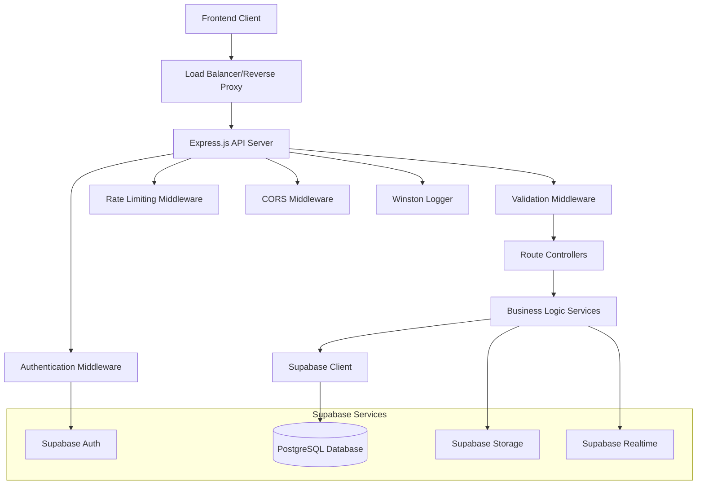

# Design Document

## Overview

The PurdueRide Backend is a RESTful API server built with Node.js, Express.js, and TypeScript that provides secure, scalable services for the PurdueRide ride-sharing application. The system follows a layered architecture pattern with clear separation of concerns, implementing Supabase Auth for authentication, PostgreSQL data persistence via Supabase, comprehensive input validation, and real-time capabilities for ride status updates.

The backend serves as the central data and business logic hub for Purdue University students to request, manage, and track rides around campus and West Lafayette at a fixed $3 price point.

## Architecture

### High-Level Architecture



### Technology Stack

- **Runtime**: Node.js 18+ with TypeScript
- **Web Framework**: Express.js 4.x with modern middleware
- **Database**: PostgreSQL via Supabase with Supabase Client
- **Authentication**: Supabase Auth with JWT tokens
- **Real-time**: Supabase Realtime for live updates
- **Storage**: Supabase Storage for file uploads
- **Validation**: Joi for request validation, PostgreSQL constraints for data validation
- **Security**: Helmet, CORS, express-rate-limit, Supabase Row Level Security (RLS)
- **Logging**: Winston with structured logging
- **Testing**: Jest with Supertest for integration testing
- **Environment**: dotenv for configuration management

### Project Structure

```
purdueride-backend/
├── src/
│   ├── config/              # Configuration files
│   │   ├── supabase.ts      # Supabase client configuration
│   │   ├── database.ts      # Database connection setup
│   │   └── index.ts         # Main config aggregator
│   ├── controllers/         # Route controllers
│   │   ├── authController.ts
│   │   ├── userController.ts
│   │   ├── rideController.ts
│   │   └── index.ts
│   ├── middleware/          # Custom middleware
│   │   ├── auth.ts          # Authentication middleware
│   │   ├── validation.ts    # Request validation
│   │   ├── errorHandler.ts  # Global error handling
│   │   ├── rateLimiter.ts   # Rate limiting
│   │   └── logger.ts        # Request logging
│   ├── models/              # Database schema types and interfaces
│   │   ├── User.ts
│   │   ├── Ride.ts
│   │   ├── RideRequest.ts
│   │   ├── Vehicle.ts
│   │   └── index.ts
│   ├── routes/              # Express routes
│   │   ├── auth.ts
│   │   ├── users.ts
│   │   ├── rides.ts
│   │   └── index.ts
│   ├── services/            # Business logic services
│   │   ├── authService.ts
│   │   ├── userService.ts
│   │   ├── rideService.ts
│   │   ├── emailService.ts
│   │   └── index.ts
│   ├── types/               # TypeScript type definitions
│   │   ├── auth.ts
│   │   ├── user.ts
│   │   ├── ride.ts
│   │   ├── api.ts
│   │   └── index.ts
│   ├── utils/               # Utility functions
│   │   ├── validation.ts
│   │   ├── encryption.ts
│   │   ├── logger.ts
│   │   ├── constants.ts
│   │   └── helpers.ts
│   ├── app.ts               # Express app setup
│   └── server.ts            # Server entry point
├── tests/                   # Test files
│   ├── unit/
│   ├── integration/
│   └── fixtures/
├── docs/                    # API documentation
├── scripts/                 # Utility scripts
├── .env.example             # Environment variables template
├── package.json
├── tsconfig.json
├── jest.config.js
└── README.md
```

## Components and Interfaces

### Authentication System

#### JWT Service
```typescript
interface JWTService {
  generateTokens(userId: string): Promise<{
    accessToken: string;
    refreshToken: string;
    expiresAt: number;
  }>;
  verifyAccessToken(token: string): Promise<JWTPayload>;
  verifyRefreshToken(token: string): Promise<JWTPayload>;
  revokeToken(token: string): Promise<void>;
}

interface JWTPayload {
  userId: string;
  email: string;
  role: UserRole;
  iat: number;
  exp: number;
}
```

#### Authentication Middleware
```typescript
interface AuthMiddleware {
  requireAuth: RequestHandler;
  requireRole(role: UserRole): RequestHandler;
  optionalAuth: RequestHandler;
}
```

### User Management System

#### User Service
```typescript
interface UserService {
  createUser(userData: CreateUserRequest): Promise<User>;
  authenticateUser(email: string, password: string): Promise<AuthResult>;
  updateProfile(userId: string, updates: UpdateProfileRequest): Promise<User>;
  verifyUser(userId: string, verificationData: VerificationData): Promise<User>;
  getUserById(userId: string): Promise<User | null>;
  getUserByEmail(email: string): Promise<User | null>;
}

interface AuthResult {
  user: User;
  tokens: {
    accessToken: string;
    refreshToken: string;
    expiresAt: number;
  };
}
```

### Ride Management System

#### Ride Service
```typescript
interface RideService {
  createRide(driverId: string, rideData: CreateRideRequest): Promise<Ride>;
  getAvailableRides(filters: RideFilters): Promise<PaginatedResult<Ride>>;
  requestRide(userId: string, rideRequest: RideRequestData): Promise<RideRequest>;
  updateRideStatus(rideId: string, status: RideStatus): Promise<Ride>;
  cancelRideRequest(requestId: string, userId: string): Promise<RideRequest>;
  getRideHistory(userId: string, pagination: PaginationParams): Promise<PaginatedResult<Ride>>;
  getRideStatus(rideId: string): Promise<Ride>;
}

interface RideFilters {
  pickupLocation?: string;
  destination?: string;
  scheduledTime?: {
    from: Date;
    to: Date;
  };
  availableSeats?: number;
}
```

### Validation System

#### Request Validation Schemas
```typescript
interface ValidationSchemas {
  auth: {
    register: Joi.ObjectSchema;
    login: Joi.ObjectSchema;
    refreshToken: Joi.ObjectSchema;
  };
  user: {
    updateProfile: Joi.ObjectSchema;
    verifyUser: Joi.ObjectSchema;
  };
  ride: {
    createRide: Joi.ObjectSchema;
    requestRide: Joi.ObjectSchema;
    updateStatus: Joi.ObjectSchema;
  };
}
```

### API Response Format

#### Standardized Response Structure
```typescript
interface ApiResponse<T = any> {
  success: boolean;
  data?: T;
  error?: {
    code: string;
    message: string;
    details?: Record<string, any>;
  };
  meta?: {
    timestamp: number;
    requestId: string;
    pagination?: PaginationMeta;
  };
}

interface PaginationMeta {
  page: number;
  limit: number;
  total: number;
  totalPages: number;
  hasNext: boolean;
  hasPrev: boolean;
}
```

## Data Models

### User Model
```typescript
interface User {
  id: string;                       // UUID primary key
  email: string;                    // Unique, required, @purdue.edu domain
  firstName: string;                // Required
  lastName: string;                 // Required
  phoneNumber: string;              // Required, validated format
  isVerified: UserVerificationStatus;
  profilePicture?: string;          // URL to Supabase Storage
  role: UserRole;                   // 'student' | 'driver' | 'admin'
  lastLogin?: Date;
  createdAt: Date;
  updatedAt: Date;
}

enum UserVerificationStatus {
  UNVERIFIED = 'unverified',
  PENDING = 'pending',
  VERIFIED = 'verified',
  REJECTED = 'rejected'
}

enum UserRole {
  STUDENT = 'student',
  DRIVER = 'driver',
  ADMIN = 'admin'
}
```

### Ride Model
```typescript
interface Ride {
  id: string;                       // UUID primary key
  driverId: string;                 // Foreign key to User
  pickupLocation: string;           // Required
  destination: string;              // Required
  scheduledTime: Date;              // Required
  estimatedArrival?: Date;
  cost: number;                     // Fixed at 3.00
  availableSeats: number;           // Required, min: 1, max: 8
  totalSeats: number;               // Required, min: 1, max: 8
  status: RideStatus;
  vehicleInfo: VehicleInfo;
  passengers: string[];             // Array of User IDs
  createdAt: Date;
  updatedAt: Date;
}

enum RideStatus {
  AVAILABLE = 'available',
  FULL = 'full',
  IN_PROGRESS = 'in-progress',
  COMPLETED = 'completed',
  CANCELLED = 'cancelled'
}

interface VehicleInfo {
  make: string;
  model: string;
  color: string;
  licensePlate: string;
  year?: number;
}
```

### RideRequest Model
```typescript
interface RideRequest {
  id: string;                       // UUID primary key
  userId: string;                   // Foreign key to User
  rideId: string;                   // Foreign key to Ride
  pickupLocation: string;           // Specific pickup location
  requestedTime: Date;              // When user wants to be picked up
  status: RideRequestStatus;
  passengerCount: number;           // Min: 1, Max: 4
  specialInstructions?: string;     // Optional notes for driver
  createdAt: Date;
  updatedAt: Date;
}

enum RideRequestStatus {
  PENDING = 'pending',
  CONFIRMED = 'confirmed',
  CANCELLED = 'cancelled',
  COMPLETED = 'completed'
}
```

### Database Indexes

#### User Table Indexes
```sql
-- Unique index on email
CREATE UNIQUE INDEX idx_users_email ON users(email);

-- Compound index for verification queries
CREATE INDEX idx_users_verification_role ON users(is_verified, role);

-- Index for user lookups
CREATE INDEX idx_users_created_at ON users(created_at DESC);
```

#### Ride Table Indexes
```sql
-- Compound index for available ride queries
CREATE INDEX idx_rides_available ON rides(status, scheduled_time, available_seats) 
WHERE status IN ('available', 'in-progress');

-- Index for driver's rides
CREATE INDEX idx_rides_driver ON rides(driver_id, created_at DESC);

-- Index for scheduled time queries
CREATE INDEX idx_rides_scheduled_time ON rides(scheduled_time);
```

#### RideRequest Table Indexes
```sql
-- Compound index for user's ride requests
CREATE INDEX idx_ride_requests_user ON ride_requests(user_id, created_at DESC);

-- Index for ride-specific requests
CREATE INDEX idx_ride_requests_ride ON ride_requests(ride_id, status);

-- Index for pending requests
CREATE INDEX idx_ride_requests_pending ON ride_requests(status, created_at) 
WHERE status = 'pending';
```

## Error Handling

### Error Classification

#### Client Errors (4xx)
```typescript
enum ClientErrorCodes {
  VALIDATION_ERROR = 'VALIDATION_ERROR',
  AUTHENTICATION_REQUIRED = 'AUTHENTICATION_REQUIRED',
  INVALID_CREDENTIALS = 'INVALID_CREDENTIALS',
  INSUFFICIENT_PERMISSIONS = 'INSUFFICIENT_PERMISSIONS',
  RESOURCE_NOT_FOUND = 'RESOURCE_NOT_FOUND',
  DUPLICATE_RESOURCE = 'DUPLICATE_RESOURCE',
  RATE_LIMIT_EXCEEDED = 'RATE_LIMIT_EXCEEDED'
}
```

#### Server Errors (5xx)
```typescript
enum ServerErrorCodes {
  INTERNAL_SERVER_ERROR = 'INTERNAL_SERVER_ERROR',
  DATABASE_ERROR = 'DATABASE_ERROR',
  EXTERNAL_SERVICE_ERROR = 'EXTERNAL_SERVICE_ERROR',
  CONFIGURATION_ERROR = 'CONFIGURATION_ERROR'
}
```

### Error Handler Middleware
```typescript
interface ErrorHandler {
  handleValidationError(error: ValidationError): ApiResponse;
  handleDatabaseError(error: PostgrestError): ApiResponse;
  handleSupabaseAuthError(error: AuthError): ApiResponse;
  handleGenericError(error: Error): ApiResponse;
}
```

### Logging Strategy

#### Log Levels and Structure
```typescript
interface LogEntry {
  timestamp: string;
  level: 'error' | 'warn' | 'info' | 'debug';
  message: string;
  requestId?: string;
  userId?: string;
  method?: string;
  url?: string;
  statusCode?: number;
  responseTime?: number;
  error?: {
    name: string;
    message: string;
    stack?: string;
  };
  metadata?: Record<string, any>;
}
```

## Testing Strategy

### Unit Testing
- **Controllers**: Test request/response handling and validation
- **Services**: Test business logic and data transformations
- **Models**: Test schema validation and middleware
- **Utilities**: Test helper functions and validation logic

### Integration Testing
- **API Endpoints**: Test complete request/response cycles
- **Database Operations**: Test CRUD operations with test database
- **Authentication Flow**: Test login, token refresh, and protected routes
- **Error Scenarios**: Test error handling and edge cases

### Test Database Setup
```typescript
interface TestConfig {
  supabase: {
    url: string;           // Test Supabase project URL
    anonKey: string;       // Test project anonymous key
    serviceRoleKey: string; // Test project service role key
  };
  database: {
    testSchema: string;    // Separate test schema in PostgreSQL
  };
}
```

### Performance Testing
- **Load Testing**: Simulate concurrent users and requests
- **Stress Testing**: Test system limits and failure points
- **Database Performance**: Test query performance with large datasets
- **Memory Usage**: Monitor memory leaks and optimization

## Security Measures

### Input Validation and Sanitization
```typescript
interface SecurityMiddleware {
  validateInput: RequestHandler;     // Joi schema validation
  sanitizeInput: RequestHandler;     // XSS prevention
  rateLimiter: RequestHandler;       // Rate limiting per IP/user
  corsHandler: RequestHandler;       // CORS configuration
  helmetSecurity: RequestHandler;    // Security headers
}
```

### Authentication Security
- **Password Hashing**: bcrypt with salt rounds (12+)
- **JWT Security**: Short-lived access tokens (15 minutes)
- **Refresh Token Rotation**: New refresh token on each use
- **Token Blacklisting**: Redis-based token revocation
- **Session Management**: Secure session handling

### Data Protection
- **Environment Variables**: Sensitive data in environment variables
- **Database Security**: Connection string encryption
- **File Upload Security**: File type validation and size limits
- **API Security**: Request signing and validation

### Rate Limiting Strategy
```typescript
interface RateLimitConfig {
  auth: {
    windowMs: number;      // 15 minutes
    max: number;           // 5 attempts per window
  };
  api: {
    windowMs: number;      // 1 minute
    max: number;           // 100 requests per window
  };
  fileUpload: {
    windowMs: number;      // 1 hour
    max: number;           // 10 uploads per window
  };
}
```

## Deployment Configuration

### Environment Variables
```typescript
interface EnvironmentConfig {
  // Server Configuration
  NODE_ENV: 'development' | 'staging' | 'production';
  PORT: number;
  HOST: string;
  
  // Supabase Configuration
  SUPABASE_URL: string;
  SUPABASE_ANON_KEY: string;
  SUPABASE_SERVICE_ROLE_KEY: string;
  
  // Security Configuration
  CORS_ORIGIN: string;
  
  // External Services
  EMAIL_SERVICE_API_KEY: string;
  
  // Logging Configuration
  LOG_LEVEL: string;
  LOG_FILE_PATH: string;
}
```

### Health Check Endpoint
```typescript
interface HealthCheck {
  status: 'healthy' | 'unhealthy';
  timestamp: string;
  uptime: number;
  services: {
    supabase: 'connected' | 'disconnected';
    database: 'connected' | 'disconnected';
    auth: 'available' | 'unavailable';
    storage: 'available' | 'unavailable';
  };
  version: string;
  environment: string;
}
```

### Monitoring and Observability
- **Application Metrics**: Response times, error rates, throughput
- **Database Metrics**: Connection pool, query performance
- **System Metrics**: CPU, memory, disk usage
- **Business Metrics**: User registrations, ride requests, completion rates

This design provides a robust, scalable, and secure foundation for the PurdueRide backend system, following modern Node.js and Express.js best practices while ensuring maintainability and extensibility.